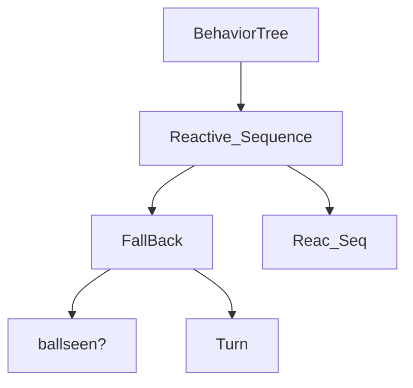

[](https://classroom.github.com/online_ide?assignment_repo_id=7213482&assignment_repo_type=AssignmentRepo)
# visual-behaviors

La práctica se compone de tres partes:

1. Seguimiento visual de la pelota: El robot debe seguir una pelota. El robot debe avanzar hasta estar a un metro, aproximadamente, de la pelota. A partir de ahí, seguira orientandose hacia ella, y tratando de mantener la distancia de un metro incluso si la pelota se mueve hacia el robot. Se usará:
   1.  Un filtro de color en HSV
   2.  Una estimación de la distancia al objeto filtrado, ya sea con PointCloud o con la imagen de profundidad.
   3.  Behavior Trees para programar la lógica de control.
   4.  PIDs para la orientación y la distancia.
2. Seguimiento visual de una persona: Similar al punto anterior, pero detectando a la persona con darket_ros.
3. Comportamiento mixto: El robot debe seguir tanto a las personas como a las pelotas que perciba con la cámara, teniendo prioridad la pelota.

Entrega: Viernes 11 de Marzo.

## Índice
- [Primer Programa](#Primer-Programa)
- [Follow Person](#Follow-Person)
- [Tercer Programa](#Tercer-Programa)

## Introducción
Explicación de la práctica + fotos + esquemas + como se ejecuta

Esta es el behaviortree:


## Primer Programa
### 1. Objetivo
El objetivo del primer programa es ...
### 2. Funciones
| Funciones | Descripción |
| --- | --- |
|  |  |
|  |  |

```c++

```
### 3. Vídeo

## Follow Person
### 1. Objetivo
El objetivo del segundo programa es seguir a una persona detectandola con darket_ros.
### 2. Lanzar el programa
Al ejecutar roscore ponemos en marcha el Master, el servidor de parámetros y rosout que es el log donde podemos mostrar datos para depuración entre otros.
```
roscore
```
Lanzamos el simulador.
```
roslaunch robots sim.launch
```
Lanzamos el darknet_ros para detectar la persona.
```
roslaunch darknet_ros darknet_ros.launch image:=/camera/rgb/image_raw
```
Lanzamos el programa.
```
roslaunch visual_behavior_los_ultramarinos follow_person.launch
```
### 3. Funciones
| Funciones | Descripción |
| --- | --- |
|  |  |
|  |  |

```c++

```
### 4. Vídeo

## Tercer Programa
### 1. Objetivo
El objetivo del tercer programa es ...
### 2. Funciones
| Funciones | Descripción |
| --- | --- |
|  |  |
|  |  |

```c++

```
### 3. Vídeo

## Tests
